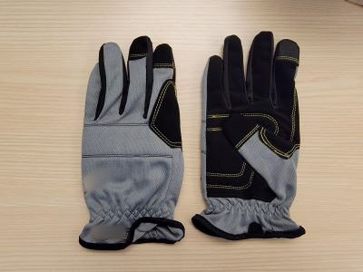

# Using HoloLens 2 With Gloves

If your need to wear gloves for your work, you may have found that some types of gloves don't work with hand tracking. This article outlines the best practices for finding gloves that work with hand tracking, and offers a few examples of common types of gloves.

## Challenges with Gloves
There are two challenges for HoloLens 2 when it comes to gloves. The first has to do with infrared light absorption. Hand tracking relies on a depth camera, which functions by projecting IR light into the scene and timing the reflectance back to the camera. Certain types of glove materials absorb infrared light and don't register in the depth image, making your hands invisible and not tracked. Black rubber is one example.

The second challenge for HoloLens 2 is baggy gloves. The larger and baggier the glove, the more it obscures the shape of your hand. And if an object in the scene doesn't look like a hand, it will not get picked up for tracking.

## Recommendations
In general, we recommend using gloves that are mid-tone colors or brighter, and as form-fitting as possible. To illustrate, we have tested a selection of gloves across common categories, and are including the results below.

### Nitrile Disposable Gloves
These are thin and tight-fitting gloves, typically made of nitril or latex, and disposed of after use. We tested several colors.

| White            | Purple           | Blue             | Black            |
| ---------------- | ---------------- | ---------------- | ---------------- |
|  |  |              |             |
| Nitrile          | Nitrile          | Nitrile          | Nitrile          |
| ✅**Pass**      | ✅**Pass**       | ✅ **Pass**      | ❌ **Fail**     |

#### Links
 - https://www.amazon.com/Nitrile-Disposable-Gloves-Large-Powder

### General Purpouse / Utility Gloves
General purpose utility gloves, lightly padded, and made of synthetic leather materials, and come in multiple colors.

| Yellow / Black   | Gray / Black     | Red / Black      | Gray / Gray      |
| ---------------- | ---------------- | ---------------- | ---------------- |
|  |  |              |             |
| Material          | Material          | Material          | Material          |
| ❌ **Fail**      | ❌ **Fail**       | ❌ **Fail**       | ✅ **Pass**     |

#### Links
  - https://www.homedepot.com/p/FIRM-GRIP-Large-Utility-Work-Gloves-3-Pack-63102-024/314420626
  - https://www.homedepot.com/p/FIRM-GRIP-General-Purpose-Large-Gray-Synthetic-Leather-Glove-3-Pack-63352-18/305583146

### Cut Resistant Gloves - A1
Intro description about these gloves. Also summarize the tracking issues expeirenced and recommendation in this category.

| Black / Gray   | White / Orange     |
| ---------------- | ---------------- |
|  |  |
| Material         | Material         |
| ❌ **Fail**      | ✅ **Pass**     |

#### Links
  - https://www.brassknuckleprotection.com/products/BK401
  - https://www.homedepot.com/p/FIRM-GRIP-Large-Nitrile-Coated-Work-Gloves-5-Pack-5558-032/205644545

### Cut Resistant Gloves - A3
Intro description about these gloves. Also summarize the tracking issues expeirenced and recommendation in this category. For Gray / Gray, had a little bit of trouble holding onto the hand on the palm side, but system gesture still worked. Can navigate shell UI without much trouble.

| Light Blue / Gray   | Gray / Black     | Light Gray / Orange      | Gray / Gray      |
| ---------------- | ---------------- | ---------------- | ---------------- |
|  |  |              |             |
| Material          | Material          | Material          | Material          |
| ✅ **Pass**      | ❌ **Fail**       | ✅ **Pass**       | ✅ **Pass**     |

 #### Links
  - https://www.uline.com/BL_3266/Uline-Dyneema-Diamond-Flex-Cut-Resistant-Gloves
  - https://www.uline.com/BL_3195/MaxiCut-Ultra-44-3745-Cut-Resistant-Gloves
  - https://www.grainger.com/product/CONDOR-Coated-Gloves-M-8-48UP97
  - https://www.grainger.com/product/SHOWA-Coated-Gloves-L-8-497D66

### Cut Resistant Gloves - A4
- Uline Durarmor Elite, Blue / Black - **Fail**
  - https://www.uline.com/BL_2689/Uline-Durarmor-Elite-Elite-Plus-Cut-Resistant-Gloves
- MCR SAFETY Coated Gloves, White / White - **Pass**
  - https://www.grainger.com/product/MCR-SAFETY-Coated-Gloves-L-9-49JY75
- SHOWA Uncoated, Gray - **Pass**
  - https://www.grainger.com/product/SHOWA-Cut-Resistant-Glove-L-8-54ZU54
- Tenactiv, White / Gray - **Pass**
  - https://www.grainger.com/product/SUPERIOR-GLOVE-Knit-Gloves-L-9-55NC54

### Cut Resistant Gloves - A5
- HyFLEX Coated Gloves, Gray / Gray - **Pass**
  - https://www.grainger.com/product/HYFLEX-Knit-Gloves-L-9-61DD67
- ANSELL Cut Resistant Gloves, Black,NeonGreen, Gray - **Almost Pass**
  - https://www.grainger.com/product/ANSELL-Cut-Resistant-Gloves-L-10-61UL17
  - Can still mostly navigate. Palm side works, but back of hand is spotty.

### Waterproof, Chemical Resistant Gloves
- SHOWR ChemRest 6784R, Black - **Fail**
  - https://link_goes_here
  - No tracking at all
- BDG Deny 14" PVC Glove, Orange - **Fail**
  - https://link_goes_here
  - Hand position tracks, spotty articulation
- HexArmor Ugly Mudder 7212, Yellow - **Fail**
  - https://link_goes_here,
  - Hand position tracks, no articulation
- QEP Multi-Purpose Gloves - **Pass**
  - Worked great!