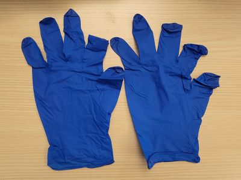
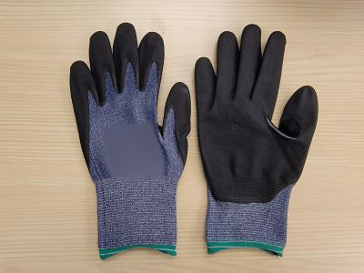
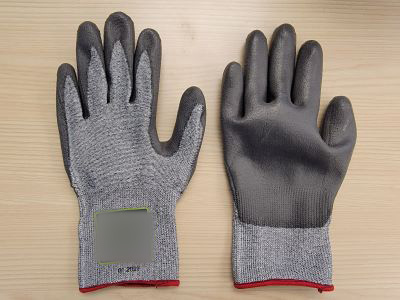
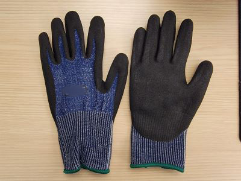
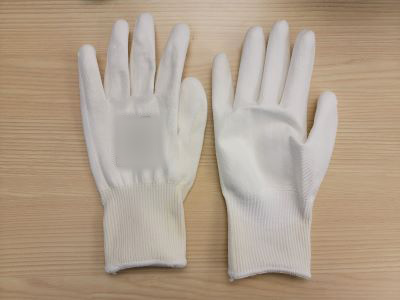
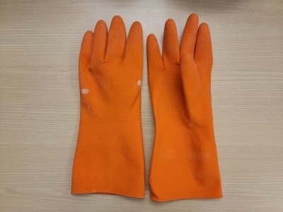

# Using HoloLens 2 With Gloves

If your need to wear gloves for your job, you may have found that some types of gloves don't work with hand tracking. This article outlines the best practices for finding gloves that do work, and offers some examples of gloves that we have tested at Microsoft.

## Challenges with Gloves
There are two main challenges when it comes to gloves on HoloLens 2 - infrared light absorption and bagginess. Read on to learn more.

### Infrared Light Absorbption
Hand tracking relies on a depth camera, which functions by projecting IR light into the scene and timing the reflectance back to the camera. Certain types of glove materials absorb the projected infrared light and therefore don't appear in the depth image, making your hands invisible and not trackable. We find that dark rubbery materials tend to exhibit this problem, and should be avoided. In general, we recommend using gloves that are mid-tone colors or brighter for best results.

Please note that IR light absorption is a challenge that only applies to users wearing gloves. For users interacting without gloves, HoloLens 2 was designed and certified to support everyone with optimal tracking results, regardless of skin tone.

### Bagginess
Hand tracking operates by finding objects in the scene that look like hands. The larger and baggier the glove, the more it obscures the shape of your hand, which reduces that chance that the algorithm can detect it. In general, we recommend selecting gloves that are as form-fitting as possible for best results.

## Glove Examples
To illustrate how different types of gloves perform with hand tracking, we have tested a selection of gloves and included the results below. Please note that these results are for informational purposes only, and not a guarantee of performance. Use these examples to guide your search for your own specific use case, and test thoroughly before deploying.

### Nitrile Disposable Gloves
These are thin and tight-fitting gloves, typically made of nitril or latex, and disposed after each use. We tested several colors, and found that all colors worked well except for black.

| White            | Purple           | Blue             | Black            |
| ---------------- | ---------------- | ---------------- | ---------------- |
|  |  |              |             |
| Nitrile          | Nitrile          | Nitrile          | Nitrile          |
| ✅**Pass**      | ✅**Pass**       | ✅ **Pass**      | ❌ **Fail**     |

#### Links
 - https://www.amazon.com/Nitrile-Disposable-Gloves-Large-Powder

### General Purpouse / Utility Gloves
These are your standard general-purpose utility gloves, typically with light padding and made of leather or synthetic leather materials. We tested several colors, and found that gloves with large stretches of black material experienced tracking drops on that side of the hand.

| Yellow / Black   | Red / Black     | Gray / Black      | Gray / Gray      |
| ---------------- | ---------------- | ---------------- | ---------------- |
|  |  |              |             |
| Synthetic Leather | Synthetic Leather | Synthetic Leather | Synthetic Leather|
| ❌ **Fail**      | ❌ **Fail**       | ❌ **Fail**       | ✅ **Pass**     |

#### Links
  - https://www.homedepot.com/p/FIRM-GRIP-Large-Utility-Work-Gloves-3-Pack-63102-024/314420626
  - https://www.homedepot.com/p/FIRM-GRIP-General-Purpose-Large-Gray-Synthetic-Leather-Glove-3-Pack-63352-18/305583146

### Cut Resistant Gloves - A1
These are thin, form-fitting utility gloves that provide grip and a low level of cut protection. They utilize a dipped rubber coating on the palm side, and a flexible material on the back. We found that the black Nylon material caused tracking problems for that side of the hand.

| Black / Gray   | Orange / White     |
| ---------------- | ---------------- |
|  |  |
| Polyurethane / Nylon | Nitril / Polyester |
| ❌ **Fail**      | ✅ **Pass**     |

#### Links
  - https://www.brassknuckleprotection.com/products/BK401
  - https://www.homedepot.com/p/FIRM-GRIP-Large-Nitrile-Coated-Work-Gloves-5-Pack-5558-032/205644545

### Cut Resistant Gloves - A3
These are thin, form-fitting utility gloves that provide grip and a medium level of cut resistance. They utilize a dipped rubber coating on the palm side, and a flexible material on the back. In this set, we found that only the pair with black nitrile material exhibited tracking problems.

| Light Blue / Gray   | Gray / Black     | Light Gray / Orange      | Gray / Gray      |
| ---------------- | ---------------- | ---------------- | ---------------- |
|  |  |              |             |
| Polyurethane / Nylon | Nitrile / HPPE | Nitrile / HPPE | Polyurethane / HPPE          |
| ✅ **Pass**      | ❌ **Fail**       | ✅ **Pass**       | ✅ **Pass** (Almost)    |

 #### Links
  - https://www.uline.com/BL_3266/Uline-Dyneema-Diamond-Flex-Cut-Resistant-Gloves
  - https://www.uline.com/BL_3195/MaxiCut-Ultra-44-3745-Cut-Resistant-Gloves
  - https://www.grainger.com/product/CONDOR-Coated-Gloves-M-8-48UP97
  - https://www.grainger.com/product/SHOWA-Coated-Gloves-L-8-497D66

### Cut Resistant Gloves - A4
These are thin, form-fitting utility gloves that provide grip and higher level of cut resistance. They typically utilize a dipped rubber coating on the palm side, and a flexible material on the back. In this set, we found once again that only the pair with black nitrile material exhibited tracking problems.

| Blue / Black   | White / White     | Gray / Gray     | White / Gray      |
| ---------------- | ---------------- | ---------------- | ---------------- |
|  |  |              |             |
| Nitrile / HPPE | Polyurethane / HPPE | HPPE | Polyurethane / TenActiv |
| ❌ **Fail**       | ✅ **Pass**       | ✅ **Pass**     | ✅ **Pass**     |

#### Links
  - https://www.uline.com/BL_2689/Uline-Durarmor-Elite-Elite-Plus-Cut-Resistant-Gloves
  - https://www.grainger.com/product/MCR-SAFETY-Coated-Gloves-L-9-49JY75
  - https://www.grainger.com/product/SHOWA-Cut-Resistant-Glove-L-8-54ZU54
  - https://www.grainger.com/product/SUPERIOR-GLOVE-Knit-Gloves-L-9-55NC54

### Cut Resistant Gloves - A5
These gloves provide a very high level of cut resistance. We tested a typical pair with a dipped rubber coating on the palm side, and another with more advanced impact protection on the back. Unfortunately we found that this extra bulk lead to tracking issues for that glove.

| Gray / Gray   | Black / Green / Gray     |
| ---------------- | ---------------- |
|  |  |
| Polyurethane / Intercept         | TPR (Impact Resistant) / HPPE |
| ✅ **Pass**     | ❌ **Fail**      | 

#### Links
  - https://www.grainger.com/product/HYFLEX-Knit-Gloves-L-9-61DD67
  - https://www.grainger.com/product/ANSELL-Cut-Resistant-Gloves-L-10-61UL17

### Waterproof, Chemical Resistant Gloves
These gloves are typically on the bulkier side and provide waterproof, chemical resistant protection for various use case. The increased bagginess creates a more challenging tracking scenario, and we found that only the orange gloves tracked well on HoloLens 2. 

| Black   | Orange Impact    | Yellow     | Orange      |
| ---------------- | ---------------- | ---------------- | ---------------- |
|  |  |              |             |
| Neoprene          | PVC          | PVC-Nitrile           | Latex            |
| ❌ **Fail**       | ❌ **Fail**       | ❌ **Fail**     | ✅ **Pass**     |

